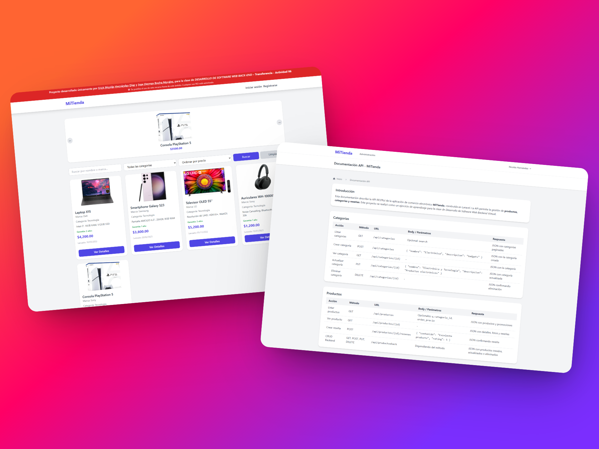

# 🛒 Tienda Online - Dispositivos Inteligentes

Este proyecto corresponde a la **Fase 1** del desarrollo de una tienda online.  
En esta primera etapa se implementó el **Front-end** del sitio web usando **Laravel con Breeze** y **Tailwind CSS**, donde los usuarios pueden explorar dispositivos inteligentes como celulares y portátiles, organizados por **fecha de lanzamiento, marca y tipo**, además de contar con filtros básicos y un buscador.  

---

## 📸 Vista previa

*(Agrega una captura en la ruta `public/assets/preview.png` o ajusta el enlace a donde guardes tu imagen)*

---

## ✨ Características principales (Fase 1)

- Listado de dispositivos inteligentes en la página inicial.
- Organización por:
  - Fecha de lanzamiento
  - Marca
  - Tipo de dispositivo
- Barra de búsqueda y filtros básicos.
- Vista de detalle de cada dispositivo con información extendida.
- Sistema de reseñas y comentarios para cada producto.
- Preparado para integrar un **sistema de administración con CRUD y login** en fases posteriores.

---

## 🛠️ Tecnologías utilizadas

- [Laravel 11](https://laravel.com/) – Framework principal.
- [Breeze](https://laravel.com/docs/11.x/starter-kits#laravel-breeze) – Sistema de autenticación básico.
- [Tailwind CSS](https://tailwindcss.com/) – Estilos responsivos y utilitarios.
- **MySQL** – Base de datos.
- **JavaScript** – Funcionalidades dinámicas del front.
- **HTML5** – Estructura del sitio.
- **CSS3** – Personalización adicional de estilos.
- **Visual Studio Code** – Editor de desarrollo.

---

## 🚀 Próximas fases del proyecto

- **Fase 2**: Desarrollo del **Back-end** con CRUD y panel de administración.
- **Fase 3**: Creación de una **API REST** para exponer y consumir datos desde el sistema.

---

## 📂 Estructura del proyecto

├── app/ # Lógica de Laravel
├── database/ # Migraciones y seeds de MySQL
├── public/
│ └── assets/
│ └── preview.png # Captura del aplicativo
├── resources/
│ ├── css/ # Estilos personalizados
│ ├── js/ # Lógica en JavaScript
│ └── views/ # Vistas Blade con Tailwind
├── routes/ # Rutas de la aplicación
├── .env # Configuración de entorno
└── README.md

---

## 👨‍💻 Autor

**Erick Hernández**  
📧 Contacto: *enhernandez@ucompensar.edu.co*  
📌 Proyecto académico Ucompensar– Desarrollo de una Tienda Online - DESARROLLO DE SOFTWARE WEB BACK-END
